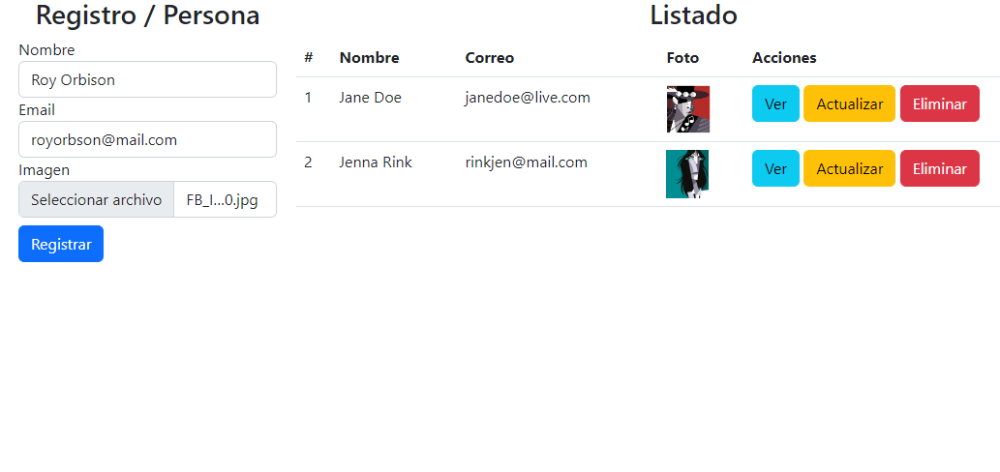

Sistema "CRUD" para escritorio, desarrollado con PHP y conectado a una base de datos Mysql. Este CRUD puede crear, leer, actualizar y eliminar registros en una tabla de la base de datos utilizando consultas SQL y PHP.

